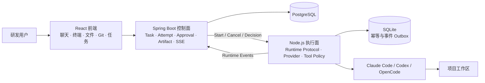

<div align="center">
  
  <h1>知枢 · AI 研发协作工作台</h1>
  <p>把一次 AI 对话，变成一条可计划、可审批、可追踪、可验收的研发链路。</p>
  <p>
    <a href="https://github.com/564TeTe/ZhiShu">项目主页</a>
    · <a href="docs/README.md">文档导航</a>
    · <a href="docs/demo-runbook.md">一键演示</a>
    · <a href="https://github.com/564TeTe/ZhiShu/issues">问题反馈</a>
  </p>
  <p>
    
    
    
    
  </p>
</div>

> 知枢是一个独立开发、持续迭代中的 AI 研发协作平台（约 8 个月）。它把聊天、终端、文件、Git、任务执行和项目资料放在同一个工作上下文里，让 Agent 的每一步都能被看见、被确认、被复盘。

## 先用一句话理解知枢

普通 AI 工具擅长“给出答案”；知枢更关注“把答案变成一次可靠的研发任务”。

你可以用自然语言描述目标，知枢先生成执行步骤，再由 Agent 在受控工作区内执行；涉及写文件、命令、测试或集成的动作可以暂停等待确认，最后把文件变更、测试结果、错误信息和执行摘要归档成可验收的结果。

```text
描述目标 → 确认执行步骤 → Agent 执行 → 查看证据并验收
```

## 它能做什么

<table>
  <tr>
    <td width="50%"><strong>对话与多模型</strong><br />在同一个项目上下文中管理 Claude Code、Codex、OpenCode 等接入线路，保留流式消息与会话历史；正式任务的执行器以当前运行时配置为准。</td>
    <td width="50%"><strong>终端、文件与 Git</strong><br />浏览和编辑项目文件，执行受控命令，查看差异、分支与提交信息。</td>
  </tr>
  <tr>
    <td><strong>任务中心</strong><br />把自然语言目标变成 Task、Attempt 和执行步骤，支持取消、重试、跟进和历史追踪。</td>
    <td><strong>审批与策略</strong><br />高风险工具在真正执行前暂停；支持人工确认、项目级自动审批策略和完整审计记录。</td>
  </tr>
  <tr>
    <td><strong>项目大脑</strong><br />沉淀项目状态、计划、工作单、上下文、决策和 Agent 能力，减少每次对话从零开始。</td>
    <td><strong>证据与验收</strong><br />统一保存摘要、文件变更、Git Diff、测试报告和错误报告，区分 Agent 声明、系统证据与人工验收。</td>
  </tr>
</table>

## 一次任务的完整链路

| 阶段 | 用户看到的内容 | 系统实际保证 |
| --- | --- | --- |
| 1 · 描述目标 | 输入问题、范围和完成标准 | 生成可确认的执行方案，不会因为生成方案就直接改代码 |
| 2 · 确认步骤 | 查看并选择要执行的步骤 | 计划版本、工作单和任务目标保持关联 |
| 3 · Agent 执行 | 实时进度、工具调用、风险操作确认 | Task / Attempt 状态机、事件顺序、取消与重试语义可追踪 |
| 4 · 结果验收 | 查看改了什么、测试是否通过、是否需要跟进 | Summary、File Change、Test Report、Error Report 等证据可回放 |

## 为什么它不只是一个聊天页面

| 普通聊天 | 知枢正式研发任务 |
| --- | --- |
| 结果停留在消息流里 | 结果进入 Task、Attempt 和 Artifact |
| 工具调用依赖临时日志 | Runtime Event 持久化，支持 SSE 实时推送和断线重放 |
| “完成”通常只是模型自己说完成 | 需要结合测试报告、文件变更和人工验收判断 |
| 多次尝试容易覆盖上下文 | 每次 Retry / Follow-up 都保留独立 Attempt 历史 |

## 架构一眼看懂



知枢保留两条清晰路径：普通 Chat 追求低延迟；正式 AgentTask 经过控制面编排，换取状态、审批、证据和验收。两侧通过协议标识关联，不共享数据库内部表。

## 已验证的真实链路

验证数据来自隔离演示仓库和自动化回归，不代表生产项目已经部署：

- 两轮真实 AgentTask 演示共 **8/8 成功**，每轮修复后独立测试均为 **3/3 通过**。
- 演示覆盖只读分析、写入审批、测试审批、SSE 初始游标重放、终态事件和安全停止。
- Spring Control Plane、Node Runtime、TypeScript typecheck、前后端生产构建均有对应回归入口。
- 详细过程、环境边界和脱敏证据见 [Demo 验收证据](docs/demo-evidence.md)。

## 快速开始

### 环境要求

- Node.js 22（见 [.nvmrc](.nvmrc)）
- Java 21
- Docker Desktop（用于 PostgreSQL）
- 需要使用的 Agent CLI / API 凭据（只放在本机 `.env`，不要提交）

### 一键启动

Windows：双击根目录的 `start.bat`；停止使用 `stop.bat`。

macOS / Linux：

```bash
bash start.sh
# 停止
bash stop.sh
```

默认前端地址：`http://localhost:3001`

### 开发与验证

```bash
npm install
npm run typecheck
npm run build
npm test
```

隔离演示链路：

```bash
npm run demo:check
npm run demo:start
npm run demo:verify
npm run demo:stop
```

首次运行请复制 `.env.example` 为 `.env` 并填写本机配置。不要把密钥、数据库目录、运行日志或构建产物提交到仓库。

## 文档入口

- [项目总览](docs/zhishu-project.md)：产品范围、核心概念和当前边界
- [系统架构](docs/architecture.md)：模块职责、数据流和关键时序
- [Runtime Protocol](docs/runtime-protocol.md)：控制面与执行面的跨进程契约
- [一键演示手册](docs/demo-runbook.md)：在隔离环境复现完整任务链路
- [Demo 验收证据](docs/demo-evidence.md)：脱敏后的任务、审批、产物和测试结果
- [实施进度](docs/implementation-progress.md)：按批次记录已完成内容与剩余风险
- [仓库结构](docs/repository-layout.md)：代码、服务、契约和文档的归属

## 当前边界与迭代方向

知枢当前是面向个人开发和小型研发协作的单机实现。Heartbeat / Lease、操作系统级构建沙箱、多 Worker 调度、RBAC 和生产级观测仍属于后续建设项；README 只描述已经在代码和演示证据中验证过的能力。

欢迎通过 [Issues](https://github.com/564TeTe/ZhiShu/issues) 反馈问题或提出改进建议。贡献前请先阅读 [CONTRIBUTING.md](CONTRIBUTING.md)。

## 许可证

知枢以 [AGPL-3.0-or-later](LICENSE) 发布，版权与第三方声明见 [NOTICE](NOTICE)。

<div align="center">
  <sub>让每一次 AI 编程，都留下可理解、可验证、可继续的研发记录。</sub>
</div>
