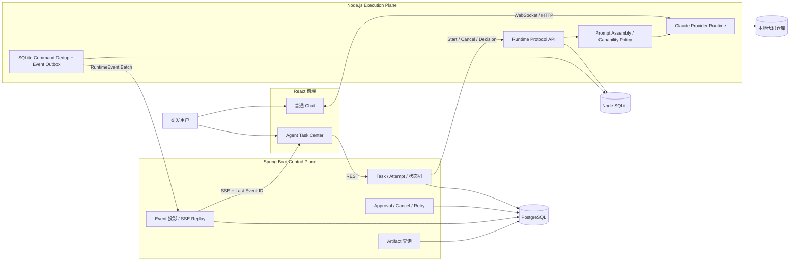
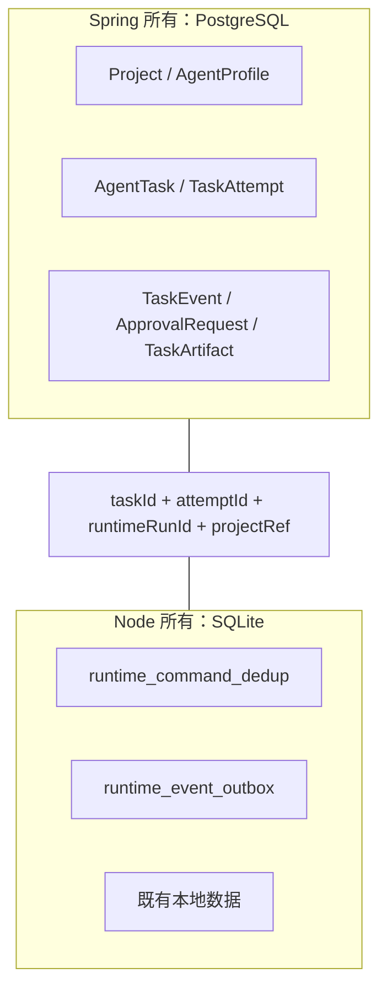
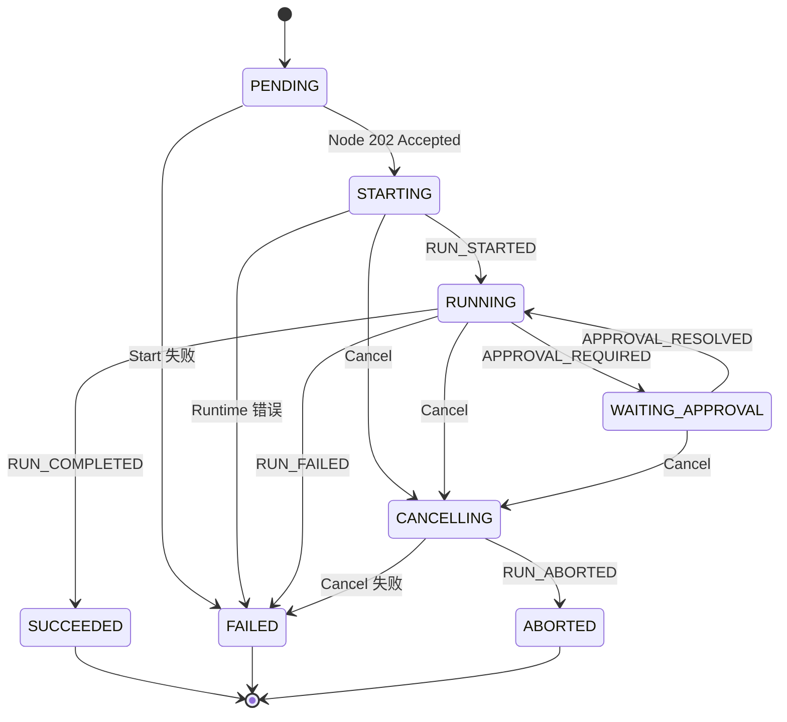
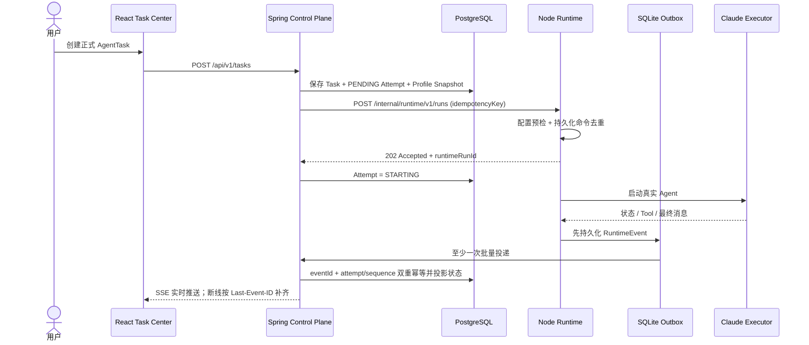
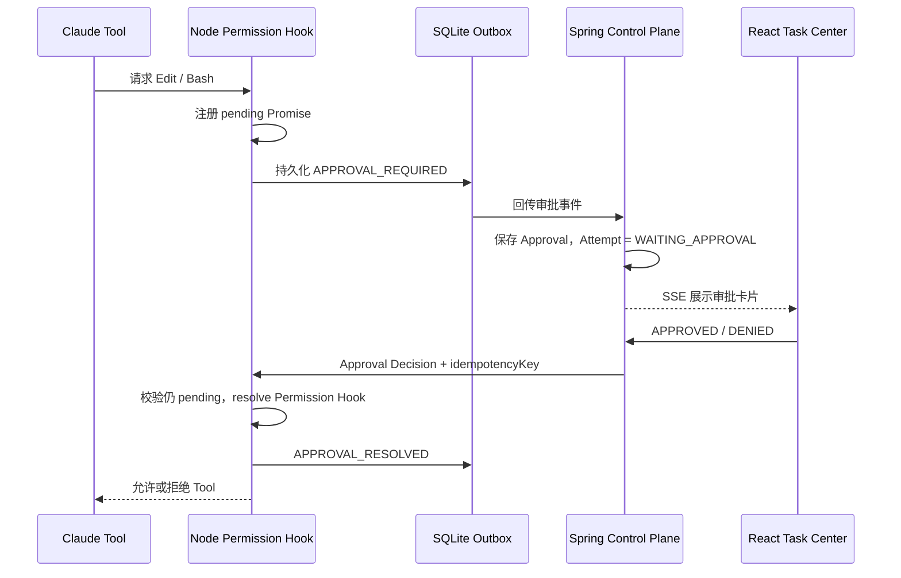
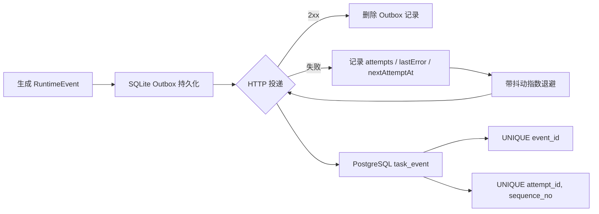

# 知枢系统架构

## 1. 总体架构

这里有两条刻意分开的产品路径：

- 普通 Chat：`React ↔ Node ↔ Provider`，追求低延迟，不创建业务 Task，也不依赖 Spring。
- 正式 AgentTask：`React ↔ Spring ↔ Node ↔ Provider`，接受额外编排成本，换取状态、审批、可靠性和归档。

## 2. 模块职责

| 层 | 模块 | 职责 |
|---|---|---|
| React | `agent-tasks` | Project 登记、Task 创建/列表、SSE 时间线、审批、取消、重试、Artifact 筛选 |
| Spring | `project/profile` | 本地工作区业务映射与不可变 Profile Snapshot |
| Spring | `task` | Task/Attempt 创建、状态机、Retry/Cancel 编排 |
| Spring | `runtime` | Runtime Protocol HTTP Client、共享令牌认证 |
| Spring | `event` | RuntimeEvent 幂等入库、投影、Deferred Reconcile、SSE 重放 |
| Spring | `approval` | 待审批查询、决策、竞态冲突处理 |
| Spring | `artifact` | 五类 Artifact 持久化与查询 |
| Node | `runtime` | Start/Cancel/Decision、Prompt Assembly、Provider 调度、事件生成 |
| Node | `database` | Runtime Command Dedup 与 Persistent Event Outbox |
| Node | `providers` | 真实 Claude 执行、Permission Hook、Tool 消息与中止 |

## 3. 数据所有权

Java 不查询 Node SQLite，Node 也不查询 PostgreSQL。两侧只通过协议标识关联，避免形成隐式共享数据库耦合。

## 4. Task / Attempt 状态机

`202 Accepted` 只表示 Node 接受命令，所以 Attempt 进入 `STARTING`；只有收到 `RUN_STARTED` 才进入 `RUNNING`。Retry 不复活旧 Attempt，而是创建 Attempt N+1，保留旧 Event 与 Artifact。

## 5. 创建任务与事件回传时序

## 6. Approval 时序

Cancel 与 Decision 竞争时，Node 先检查 Run 是否终态、审批是否仍 pending；迟到决策返回 409，不恢复已取消的 Tool。

## 7. 可靠投递与幂等

- 语义为 At-Least-Once：网络超时后允许重复投递，Spring 精确去重。
- 同一 Run 使用 sequence 屏障，前序失败时后序不越过；不同 Run 可独立推进。
- Node 重启后重新扫描 pending 记录；健康接口暴露 pending/due/oldest/attempts/error，不返回令牌。
- 尚未实现 Heartbeat/Lease，因此不能声称 Provider 进程崩溃后的 Run 自动恢复。

## 8. 安全与故障边界

- 内部 Runtime/Control API 使用独立 Bearer Token；未配置时正式 Start 在 Provider 启动前返回 503。
- 配置错误响应和 health 只返回配置项名称，不返回秘密值。
- Profile Snapshot 只冻结执行策略，不保存 API Key、Token 或 Authorization。
- 普通 Chat 与正式 Task 解耦：Spring 暂停不会让原 Chat 路径不可用。
- 当前是单机实现；面向多 Worker 演进时需要 Worker Registry、Lease、调度和对象存储，而不是简单复制 Node 实例。
