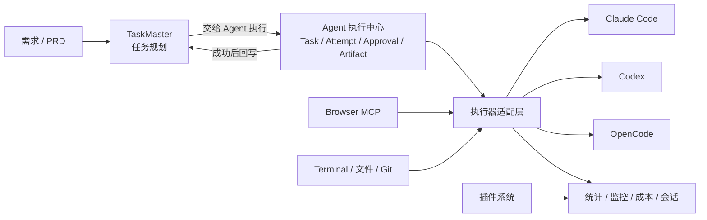

# 知枢现有能力整合与后续实施路线

> 更新时间：2026-08-13  
> 目标：最大限度复用 CloudCLI UI 已有的插件、TaskMaster、Browser 和多 CLI 能力，把已经完成的 Agent Task 控制面升级为统一的 Agent 执行中心。

## 1. 结论

后续不再重复建设插件框架、PRD 任务看板或浏览器自动化底座。项目调整为四层：

1. **规划层**：TaskMaster 负责 PRD 拆解、任务依赖和待办状态。
2. **执行控制层**：现有 Spring Control Plane 负责 Task、Attempt、审批、取消、重试、事件、Artifact 和审计。
3. **执行与工具层**：Claude Code、Codex、OpenCode 负责执行；Terminal、Browser MCP 等提供工具。
4. **扩展与观测层**：现有插件系统提供统计、监控、会话、成本等可插拔页面。



## 2. 现有能力如何利用

| 能力 | 现状 | 后续用途 | 决策 |
|---|---|---|---|
| 插件系统 | 支持 Git 安装、启停、更新、卸载、自定义 Tab 和可选 Node 后端 | 项目统计、终端、会话监控、成本分析、未来线路管理 UI | 直接复用 |
| TaskMaster | 已有前后端集成，但本机 CLI 未安装 | PRD 拆分、任务看板、任务依赖和优先级 | 安装并接入执行中心 |
| Browser | 已有受控 Playwright 会话和 MCP 工具 | Agent 验证网页、操作表单、截图和 E2E 检查 | 安装运行时并注册为能力 |
| Agent Task | 已实现 Task/Attempt、审批、事件、Artifact、Outbox | 统一执行、审计和状态控制 | 保留并改名为“Agent 执行中心” |
| Claude/Codex/OpenCode | 普通会话已有多 CLI 基础，正式 Agent Runtime 仍需统一 | 作为可选择的执行器 | 分阶段接入 |
| 模型线路切换 | 尚无安全的任务级连接管理 | Claude Code 中转站、官方线路及其他 Provider 切换 | 核心后端 + 插件 UI 混合实现 |

## 3. 分阶段计划

### 阶段 A：启用并验收上游现成功能

目标：先知道现成功能真实可用到什么程度，停止重复开发。

- 安装 TaskMaster AI CLI，并在一个演示项目中初始化。
- 启用 Browser，安装 Playwright 和 Chromium，完成打开网页、截图、关闭会话的验证。
- 安装 Project Stats、Claude Watch、Sessions 等低风险插件并逐一记录效果。
- 建立“保留 / 后续 / 不采用”的插件清单。

验收：TaskMaster 能显示真实任务；Browser 能产生一次受控会话；每个保留插件都能正常启停。

预计：0.5～1 天。

### 阶段 B：把 Agent Task Center 收敛成执行中心

目标：消除它与 TaskMaster 在视觉和概念上的重复。

- 页面名称改为“Agent 执行中心”。
- 创建区只保留：执行目标、执行器、线路、权限模式。
- 默认展示“正在分析、准备修改、等待批准、正在测试、已完成”等人类可读步骤。
- 原始 Runtime Event JSON 收到“技术详情”。
- 明确展示 Attempt、工具审批、改动文件、测试结果和最终总结。

验收：第一次使用的人能在一分钟内说清楚任务正在做什么、是否需要操作、最终改了什么。

预计：1～2 天。

### 阶段 C：打通 TaskMaster 与 Agent 执行中心

目标：形成“规划—执行—回写”的产品闭环。

- 在 TaskMaster 任务卡和详情页增加“交给 Agent 执行”。
- 将标题、描述、验收条件、项目路径组装成 AgentTask objective。
- 保存 `taskmasterTaskId <-> agentTaskId/attemptId` 关联。
- 在 TaskMaster 中展示运行中、等待批准、成功、失败状态。
- 成功后允许回写 TaskMaster 为 done；失败时保留错误摘要和重试入口。

验收：从一个 TaskMaster 任务出发，无需重复粘贴内容即可执行，并能看到结果回写。

预计：2～3 天。

### 阶段 D：轻量 CC Switch MVP

目标：同一个 Claude Code 执行器可以安全切换官方 API、DeepSeek 兼容线路或其他中转站。

- 核心 Node 后端新增 Runtime Connection 管理。
- API Key 使用系统安全存储或加密保存，列表接口永不返回明文。
- 支持名称、Base URL、认证方式、模型映射、启用状态和连接测试。
- 启动每次 Attempt 时生成配置快照，并只向该子进程注入环境变量。
- 将管理界面做成官方内置插件 Tab；涉及密钥与进程注入的逻辑留在核心后端。
- 日志、错误、事件和 Artifact 全部做密钥脱敏。

验收：同一个测试任务可分别通过两条 Claude Code 线路运行，历史 Attempt 能说明使用了哪个配置版本，但不泄漏密钥。

预计：3～5 天。

### 阶段 E：正式接入 Codex 与 OpenCode 执行器

目标：执行中心不再固定使用 Claude Code。

- 为 Codex、OpenCode 分别实现 Executor Adapter。
- 统一启动、流式事件、取消、超时、退出码和最终结果。
- 将不同 CLI 的工具调用映射到统一 Approval 语义。
- 前端只展示各执行器真实支持的模型与权限模式。
- 用同一个固定 Demo Repository 做执行器对照验收。

验收：三个执行器至少各完成一次真实代码修改和测试；失败、取消和超时语义一致。

预计：4～7 天。

### 阶段 F：复用 Browser 作为 Agent 工具

目标：让执行任务具备可观察的网页验证能力。

- 在 Agent Profile 中增加 `BROWSER` capability。
- 启动 Attempt 时按需注册现有 Browser MCP，而不是新建浏览器服务。
- 将访问地址白名单、会话时限和用户可见性纳入权限策略。
- 将截图和页面摘要登记为 Artifact。

验收：Agent 修改前端后，能启动项目、打开页面、完成一次操作并生成截图证据。

预计：2～3 天。

### 阶段 G：稳定性与求职演示

目标：把功能变成可重复演示、可解释的工程成果。

- 增加跨模块集成测试和固定 E2E 脚本。
- 完善一键启动、依赖预检和错误提示。
- 增加执行器、线路、耗时、成功率和成本统计。
- 准备架构图、两分钟演示路径、故障案例和简历描述。

验收：全新环境按文档可以启动；固定 Demo 连续运行两次；关键失败有明确恢复路径。

预计：2～3 天。

## 4. 插件使用方法

### 4.1 安装社区插件

1. 打开“设置 → 插件”。
2. 推荐插件直接点击“安装”；其他插件把 Git 仓库地址粘贴到顶部输入框后点击“安装”。
3. 安装完成后打开右侧开关。
4. 插件会作为新的顶部 Tab 出现；如果没有出现，刷新插件或重启应用。
5. 插件有新版本时使用刷新/更新按钮；不再使用时先关闭，再卸载。

插件安装过程会克隆仓库、安装依赖并执行构建。插件前端与宿主运行在同一页面上下文，后端也会作为本机子进程运行，因此只安装已经检查源码或可信作者发布的插件。

### 4.2 当前推荐清单

| 插件 | 建议 | 使用目的 |
|---|---|---|
| Web Terminal | 保留，当前已安装 | 在网页内运行项目命令和查看日志 |
| Project Stats | 安装 | 快速展示代码规模，适合演示 |
| Claude Watch | 安装 | 监控长时间 Claude Code 会话和卡死情况 |
| Sessions | 第二批安装 | 查看和停止活跃 Claude Code 会话 |
| PRISM | 第二批安装 | 分析 Claude Code 会话与 Token 消耗 |
| Token Cost Calculator | 第二批安装 | 展示模型成本估算 |
| CloudCLI Scheduler | 后续 | 做定时任务，不是当前主链路 |
| Task Queue | 暂缓 | 与 Agent 执行中心的队列/任务入口高度重叠 |
| GitHub Issues Board | 暂缓 | 有价值，但应在 TaskMaster 桥接完成后再接入，避免同时维护三套任务来源 |

### 4.3 自己开发插件

仓库已经提供 `plugins/starter` 模板。插件适合实现：独立 Tab、统计面板、监控页面、外部服务集成和通过 RPC 调用自己的 Node 后端。

插件当前不适合直接实现：修改内置聊天、接管 Executor、拦截宿主请求、直接访问认证令牌或修改 Task/Attempt 状态机。CC Switch 因此采用“插件负责界面、核心模块负责密钥与运行时注入”的混合方案。

## 5. TaskMaster 与 Browser 启用方式

### TaskMaster

```powershell
npm install -g task-master-ai
```

安装后重启应用，在目标项目中运行：

```powershell
npx task-master init
```

然后使用 TaskMaster 页面创建或导入 PRD、生成任务并维护依赖。阶段 C 完成前，它只负责规划，不负责进入我们的正式 Agent Attempt 流程。

### Browser

1. 打开“设置 → 浏览器”，启用 Browser。
2. 打开顶部 Browser 页面。
3. 点击“Install Runtime”，等待 Playwright 和 Chromium 安装完成。
4. 创建一次临时会话，验证打开网址、截图和关闭会话。

Browser 安装包较大，首次安装可能需要等待；它不是普通浏览器标签，而是供 Agent 调用、用户可监控的自动化会话。

## 6. 当前优先级

严格按以下顺序推进：

1. 阶段 A：启用并验收现成功能。
2. 阶段 B：执行中心概念和界面收敛。
3. 阶段 C：TaskMaster 到 Agent 的桥接。
4. 阶段 D：CC Switch MVP。
5. 阶段 E：Codex/OpenCode 正式执行器。
6. 阶段 F：Browser 工具化。
7. 阶段 G：稳定性和求职演示。

在阶段 C 完成前，不安装 Task Queue；在密钥安全存储和进程级注入完成前，不把 CC Switch 做成纯社区插件。
