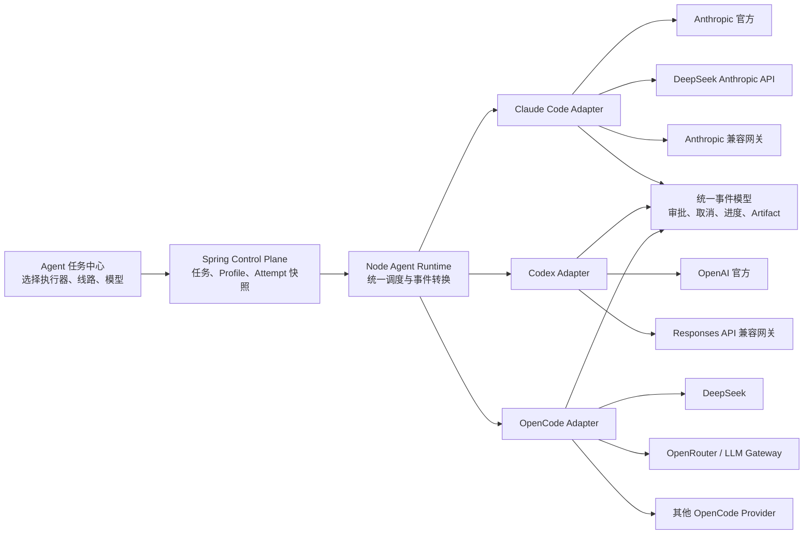

# 知枢多执行器与轻量模型线路切换建设方案

> 文档版本：v1.0  
> 编制日期：2026-08-13  
> 当前结论：方案可行，推荐先完成 Claude Code 多线路切换，再接入 Codex，最后完善 OpenCode。

## 1. 背景与目标

当前知枢的正式 Agent Task 只允许使用 Claude Code 执行器。实际使用中，Claude Code 的模型请求可能通过 DeepSeek、Anthropic 官方接口或其他 Anthropic 兼容网关完成。后续还希望把正式任务切换到 Codex 或 OpenCode 执行。

本方案希望在网页中提供一个轻量的 CC Switch 类能力，但不照搬桌面工具的全部功能。知枢只负责研发任务真正需要的部分：

1. 管理模型服务线路与密钥。
2. 创建任务时选择执行器、线路和模型。
3. 每次 Attempt 固化实际使用的配置快照。
4. 将不同执行器的输出归一为统一事件、审批、取消和 Artifact。
5. 保持历史任务可追踪、可解释、可审计。

## 2. 核心概念

系统必须明确区分以下三层，前端不能再笼统地称为“模型”或“Provider”。

| 层级 | 含义 | 示例 |
|---|---|---|
| 执行器 Executor | 负责分析代码、规划并调用工具的 Agent 程序 | Claude Code、Codex、OpenCode |
| 模型线路 Connection | 执行器访问模型服务的地址与认证方式 | Anthropic 官方、DeepSeek Anthropic API、OpenAI 官方、中转站 |
| 模型 Model | 线路最终调用的具体模型 | Claude、DeepSeek、GPT 系列模型 |

例如：

```text
执行器：Claude Code
模型线路：DeepSeek 官方 Anthropic API
模型：deepseek-v4-pro
```

这表示 Agent 工具、文件读写和执行循环仍由 Claude Code 提供，但底层推理由 DeepSeek 模型完成。

## 3. 可行性结论

### 3.1 总体判断

方案可行，整体难度为中等，不需要重写现有系统。

项目目前已经具备以下基础：

- Provider 注册表已经注册 Claude、Codex、OpenCode 三种实现。
- 三种 Provider 均已有聊天场景使用的 Runtime Adapter。
- Node Runtime Start 协议已经包含 `executor` 和 `modelAlias`。
- Spring `agent_profile` 已经保存 `executor` 和 `model_alias`。
- Task、Attempt、Approval、Event、Artifact 和 Runtime Outbox 可继续复用。

当前主要限制：

- Node 正式 Runtime 已支持 `claude`、`codex`、`opencode` 三种执行器分发，Cursor 仍仅限聊天。
- Spring `ExecutorType` 已有 `CLAUDE`、`CODEX`、`OPENCODE`。
- 项目初始化只创建一个 Claude 默认 Profile。
- 正式 Runtime 的能力与工具映射使用 Claude 工具名称；Codex/OpenCode 的能力约束暂只按只读 `plan` 模式落地。
- Codex 和 OpenCode 的审批机制尚未接入知枢 Approval 闭环。
- 当前通用凭据表明文保存 `credential_value`，不能用于线路 API Key。

### 3.2 难度分级

| 能力 | 可行性 | 难度 | 说明 |
|---|---:|---:|---|
| Claude Code 切换 DeepSeek/官方/中转站 | 很高 | 低至中 | 官方支持通过 Base URL 和认证变量连接网关 |
| Claude Code 模型切换 | 很高 | 低 | 需要模型目录、默认值和连通性验证 |
| 正式 Agent 使用 Codex | 高 | 中 | 已有 Adapter，需补统一事件和网页审批 |
| 正式 Agent 使用 OpenCode | 高 | 中至高 | 非交互执行的暂停审批与恢复需要单独设计 |
| 三执行器完全一致的治理能力 | 可行 | 中至高 | 三方事件和权限协议不同，必须使用适配层 |

## 4. 范围与非目标

### 4.1 第一版范围

- 管理 Claude Code 使用的模型线路。
- 内置 Anthropic 官方、DeepSeek 官方和自定义 Anthropic 兼容线路模板。
- 支持 Base URL、API Key、模型名称和自定义请求头。
- 支持线路连接测试。
- 创建任务时选择线路和模型。
- 对密钥、日志和任务数据进行脱敏。
- Attempt 保存执行配置快照。

### 4.2 第一版非目标

- 不完整复刻 CC Switch 的导入、导出、测速排行和系统代理管理。
- 不在一个运行中的 Attempt 内热切换线路。
- 不在用户无感知的情况下自动切换到另一个模型供应商。
- 不保证所有中转站都完整兼容图片、MCP、Prompt Cache 和扩展字段。
- 不在第一版同时实现三种执行器的完整网页审批。

## 5. 目标架构



### 5.1 职责边界

#### React 前端

- 展示线路和执行器状态。
- 创建、修改、禁用和测试线路。
- 创建任务时选择 Agent Profile。
- 展示本次 Attempt 实际使用的执行器、线路和模型。
- 不读取或缓存完整 API Key。

#### Spring Control Plane

- 管理 Profile 与 Task 的业务关系。
- 保存非敏感的线路引用。
- 为每次 Attempt 固化执行配置快照。
- 继续作为任务状态、审批和审计的权威来源。
- 不接收线路 API Key 明文。

#### Node Runtime

- 保存或访问本机安全凭据。
- 解析 Connection，并只向对应子进程注入运行时环境变量。
- 根据 Executor 选择 Runtime Adapter。
- 将不同执行器原生事件转换成知枢统一事件。
- 确保密钥不进入日志、事件和 Artifact。

#### Executor Adapter

- 负责执行器特有的启动、取消、审批恢复和事件解析。
- 负责将统一 Capability 映射为执行器自己的工具与沙箱策略。
- 不负责 Task/Attempt 状态持久化。

## 6. 数据模型

### 6.1 Runtime Connection

建议在 Node 本地数据库新增线路表，因为密钥与 CLI 执行均属于本机 Runtime 边界。

```text
runtime_connection
├── id                    UUID
├── name                  TEXT
├── executor              claude | codex | opencode
├── protocol              anthropic | responses | openai-compatible
├── base_url              TEXT
├── credential_ref        TEXT
├── default_model         TEXT
├── custom_headers_json   TEXT
├── capability_flags_json TEXT
├── enabled               BOOLEAN
├── created_at            DATETIME
└── updated_at            DATETIME
```

`credential_ref` 只能指向安全凭据存储中的条目，不允许保存明文 Key。

### 6.2 Agent Profile

现有 `agent_profile` 增加：

```text
connection_id      UUID/TEXT，可空
```

Profile 仍然负责：

- executor
- connectionId
- modelAlias
- capabilities
- permissionPolicy
- timeoutSeconds
- promptVersion

### 6.3 Attempt 配置快照

现有 `task_attempt.profile_snapshot` 应扩展为：

```json
{
  "executor": "claude",
  "connectionId": "conn_xxx",
  "connectionName": "DeepSeek 官方",
  "protocol": "anthropic",
  "baseUrlRedacted": "https://api.deepseek.com/anthropic",
  "modelAlias": "deepseek-v4-pro",
  "capabilities": ["READ_FILE", "WRITE_FILE", "SEARCH_CODE", "SHELL", "GIT", "TEST"],
  "requireApprovalFor": ["WRITE_FILE", "SHELL", "GIT"],
  "timeoutSeconds": 600,
  "promptVersion": "task-v1"
}
```

快照不得包含 API Key、Authorization Header 或可还原的凭据内容。

## 7. API 草案

### 7.1 Node 本地线路 API

```text
GET    /api/runtime-connections
POST   /api/runtime-connections
PATCH  /api/runtime-connections/:id
DELETE /api/runtime-connections/:id
POST   /api/runtime-connections/:id/test
GET    /api/runtime-connections/:id/models
```

创建请求示例：

```json
{
  "name": "DeepSeek 官方",
  "executor": "claude",
  "protocol": "anthropic",
  "baseUrl": "https://api.deepseek.com/anthropic",
  "apiKey": "只在写入时提交",
  "defaultModel": "deepseek-v4-pro",
  "customHeaders": {}
}
```

读取响应示例：

```json
{
  "id": "conn_xxx",
  "name": "DeepSeek 官方",
  "executor": "claude",
  "protocol": "anthropic",
  "baseUrl": "https://api.deepseek.com/anthropic",
  "credentialConfigured": true,
  "credentialHint": "****a91f",
  "defaultModel": "deepseek-v4-pro",
  "enabled": true,
  "health": "AVAILABLE"
}
```

### 7.2 Spring Profile API

建议新增：

```text
GET    /api/v1/projects/:projectId/profiles
POST   /api/v1/projects/:projectId/profiles
PATCH  /api/v1/profiles/:profileId
POST   /api/v1/profiles/:profileId/enable
POST   /api/v1/profiles/:profileId/disable
```

Task 创建接口继续提交 `profileId`，避免把线路配置散落在每次请求中。

### 7.3 Runtime Start 协议

建议在 v1 兼容扩展中增加：

```json
{
  "executor": "claude",
  "connectionRef": "conn_xxx",
  "modelAlias": "deepseek-v4-pro"
}
```

Node 收到后执行：

1. 校验 Executor 与 Connection 是否匹配。
2. 从安全存储解析凭据。
3. 生成仅属于该 Run 的环境变量。
4. 启动对应 Adapter。
5. 立即清除临时对象引用，不打印环境变量。

## 8. 执行器适配策略

### 8.1 Claude Code

统一 Capability 映射可沿用现有实现：

| 知枢 Capability | Claude 工具 |
|---|---|
| READ_FILE | Read |
| WRITE_FILE | Edit、Write、NotebookEdit |
| SEARCH_CODE | Glob、Grep |
| SHELL | Bash |
| GIT | Bash |
| TEST | Bash |

线路环境只注入当前 Run：

```text
ANTHROPIC_BASE_URL
ANTHROPIC_API_KEY 或 ANTHROPIC_AUTH_TOKEN
模型映射相关变量
```

不得修改用户的系统级环境变量或全局 Claude 配置文件。

### 8.2 Codex

短期可复用现有 `@openai/codex-sdk` Adapter 完成只读和受沙箱写入任务。

完整网页审批建议迁移至 Codex App Server：

- `item/commandExecution/requestApproval` 对应命令审批。
- `item/fileChange/requestApproval` 对应文件修改审批。
- 知枢 Approval Decision 回写 App Server。
- `item/completed` 转换为命令、文件和 Artifact 事件。

Codex 自定义线路使用用户级 Profile 或单次运行配置覆盖。供应商配置不能写入项目 `.codex/config.toml`，避免项目代码控制凭据和模型路由。

### 8.3 OpenCode

现有 Adapter 已支持：

- `opencode run --format json`
- `--model provider/model`
- `--dir`
- 取消子进程
- Token 数据读取

第一步只开放只读任务。原因是 OpenCode 非交互模式下：

- `ask` 权限无法像 Claude 一样直接等待当前网页回调。
- `--auto` 会自动批准权限，不符合知枢正式审批语义。

后续应调研 OpenCode Server/SDK 的交互式 Permission API，再开放正式写入任务。

## 9. 统一事件模型

Adapter 不得直接让前端理解 Claude、Codex 或 OpenCode 的原始消息。它们统一转换为：

```text
RUN_STARTED
AGENT_STATUS
TOOL_STARTED
APPROVAL_REQUIRED
APPROVAL_RESOLVED
COMMAND_COMPLETED
FILE_CHANGED
ARTIFACT_PUBLISHED
ERROR
RUN_COMPLETED
RUN_FAILED
RUN_ABORTED
```

所有事件建议增加非敏感元数据：

```json
{
  "executor": "codex",
  "connectionName": "OpenAI 官方",
  "modelAlias": "selected-model"
}
```

原始 Provider Event 只用于诊断，并必须经过字段白名单和密钥脱敏后才能持久化。

## 10. 前端设计

### 10.1 模型与线路页面

```text
模型与线路

[新增线路]

DeepSeek 官方
Claude Code · Anthropic 协议
https://api.deepseek.com/anthropic
默认模型：deepseek-v4-pro
密钥：已配置 ****a91f
状态：可用
[测试连接] [编辑] [禁用]
```

新增或编辑线路时分三步：

1. 选择执行器。
2. 选择官方模板或自定义兼容线路。
3. 填写认证与模型，并测试连接。

### 10.2 Agent Task 创建区域

```text
任务目标：修复登录失败并运行测试

执行方式
[Claude Code ▼] [DeepSeek 官方 ▼] [deepseek-v4-pro ▼]

权限
✓ 读取文件自动允许
✓ 修改文件需要确认
✓ 执行命令需要确认

[创建并执行]
```

### 10.3 任务详情

任务标题下方固定显示：

```text
Claude Code · DeepSeek 官方 · deepseek-v4-pro
配置已固化于 Attempt #2
```

线路不可用时必须显示明确错误，不得笼统显示“Provider failed”。

## 11. 安全设计

### 11.1 凭据保存

现有 `user_credentials.credential_value` 为明文，不得直接复用。

优先方案：

1. Windows 使用 Credential Manager。
2. macOS 使用 Keychain。
3. Linux 使用 Secret Service。
4. 无系统凭据服务时，使用 AES-256-GCM 加密文件，并要求独立主密钥。

数据库只保存 `credential_ref`。

### 11.2 凭据使用

- API Key 仅注入对应 Agent 子进程。
- 不写入命令行参数。
- 不返回给浏览器。
- 不发送到 Spring。
- 不进入 Task、Attempt、Event、Approval 或 Artifact。
- 子进程结束后释放临时环境对象。

### 11.3 日志脱敏

统一屏蔽：

```text
Authorization
Proxy-Authorization
x-api-key
api-key
ANTHROPIC_API_KEY
ANTHROPIC_AUTH_TOKEN
OPENAI_API_KEY
CODEX_API_KEY
包含 token/key/secret 的自定义 Header
```

### 11.4 SSRF 防护

自定义 Base URL 可能被用于访问本机或内网服务，因此需要：

- 只允许 `https`；本地开发模式可显式允许 loopback `http`。
- 拒绝文件协议和其他非 HTTP 协议。
- 解析 DNS 后检查私有、链路本地和元数据地址。
- 限制重定向次数，并对重定向目标重复检查。
- Test Connection 设置短超时、响应大小上限和并发限制。

## 12. 分阶段实施计划

### Phase 0：契约与安全底座

预计 1～2 天。

- 定义 Executor、Connection、Protocol 和 Capability 类型。
- 确定本机安全凭据方案。
- 增加统一日志脱敏工具。
- 定义 Connection API 和 Attempt 快照格式。
- 保持当前 Claude 默认 Profile 行为不变。

验收：

- 设计评审通过。
- API Key 不以明文写入 SQLite/PostgreSQL。
- 旧任务与旧 Profile 可继续执行。

### Phase 1：Claude Code 轻量 CC Switch MVP

预计 3～5 天。

- 新增 Connection CRUD。
- 内置 Anthropic、DeepSeek、自定义 Anthropic 兼容模板。
- 新增 Test Connection。
- 新增模型与线路管理页面。
- 创建任务时选择 Claude Profile/Connection/Model。
- Runtime 按 Run 注入 Claude 环境。
- 时间线显示实际线路与模型。
- Attempt 保存配置快照。

当前已落地一条完整垂直链路：Node 本地 `runtime_connections` 表、加密 API Key、线路列表/创建/更新/删除/测试接口、健康状态与失败分类、密钥轮换、设置页“模型线路”，以及 Agent Task Center 的线路选择。正式 Runtime 通过 `connectionRef` 查找线路，并使用 Claude SDK `options.env` 按 Run 注入 `ANTHROPIC_BASE_URL`、认证变量和默认模型；旧任务不带 `connectionRef` 时保持原行为。Profile 已增加正式 `connection_ref` 字段与 Flyway V3 迁移，Attempt 快照固化执行器、模型与线路，删除保护与任务详情展示也已接入。

2026-08-13 起多执行器开始放开关：Agent Task Center 新增执行器选择（Claude Code / Codex / OpenCode），Spring `ExecutorType` 增加 `CODEX`、`OPENCODE`，任务创建支持单次 `executor` 覆盖并写入 Attempt 快照；Node Runtime 移除 Claude-only 限制，按 Executor 分发到已有 Provider Adapter。Codex 与 OpenCode 的只读任务（不含 WRITE_FILE/SHELL/GIT/TEST 能力）以 `plan` 模式执行（Codex `sandboxMode: read-only`、OpenCode `--agent plan`），事件已归一为统一事件；非 Claude 执行器的网页审批、完整写入能力和取消时序仍属于 Phase 2 / Phase 3。

验收：

- Anthropic 官方线路可创建只读任务。
- DeepSeek 线路可完成读取、修改审批、测试和总结任务。
- 自定义错误 Key 能给出认证失败，而不是通用 500。
- 切换默认线路不影响正在运行的 Attempt。
- 日志、数据库和浏览器响应中搜索不到完整 API Key。

### Phase 2：Codex 正式执行器

预计 4～7 天。

- Spring 增加 `CODEX`。
- Node 移除 Claude-only 限制，按 Executor 分发。
- 将 Claude 工具映射拆为 Adapter Capability Policy。
- Codex 原生事件转换成统一事件。
- 支持取消、Artifact、Token 和终态。
- 使用 App Server 接入命令与文件网页审批。
- 支持 OpenAI 官方和兼容线路。

验收：

- Codex 只读任务成功。
- Codex 修改任务在网页出现审批，未批准前文件不变化。
- 批准后继续执行并产生 File Change 和 Summary。
- 拒绝、取消、超时和 Runtime 重启均有明确终态。

### Phase 3：OpenCode 正式执行器

预计 4～8 天。

- Spring 增加 `OPENCODE`。
- 先开放只读任务和模型选择。
- 归一 OpenCode JSON 事件。
- 支持连接健康、取消、Token 和 Artifact。
- 调研并接入可暂停恢复的 Permission API。
- 权限闭环完成后开放写文件与命令任务。

验收：

- `provider/model` 被正确传递并写入 Attempt 快照。
- 只读任务不会修改工作区。
- 写入能力开放前，系统不能通过 `--auto` 绕过知枢审批。
- 正式写入开放后，审批语义与 Claude/Codex 一致。

### Phase 4：稳定性与求职材料

预计 2～3 天。

- 三执行器契约测试。
- 每条线路健康检查和失败分类。
- 连接切换、禁用、密钥轮换和回滚测试。
- 完成演示证据、架构图和面试讲解。
- 连续执行多轮 Claude、Codex、OpenCode 对比任务。

## 13. 测试计划

### 13.1 单元测试

- Connection 输入校验与 URL 安全检查。
- 凭据加密、读取、轮换和删除。
- 日志脱敏。
- Executor/Connection 匹配校验。
- Capability 到 Provider Policy 的映射。
- 三套原生事件到统一事件的转换。

### 13.2 集成测试

- Spring Profile 到 Runtime Start 命令。
- Attempt Profile Snapshot 持久化。
- Runtime Start 幂等键包含 Connection 与 Model 语义。
- Outbox 重试不会重复创建 Approval 或 Artifact。
- 禁用线路不影响已启动 Attempt，但拒绝新 Attempt。

### 13.3 端到端测试矩阵

| 场景 | Claude | Codex | OpenCode |
|---|---:|---:|---:|
| 只读审查 | 必须 | 必须 | 必须 |
| 修改文件审批 | 必须 | Phase 2 必须 | Phase 3 后期必须 |
| 执行测试审批 | 必须 | Phase 2 必须 | Phase 3 后期必须 |
| 用户拒绝 | 必须 | 必须 | 必须 |
| 用户取消 | 必须 | 必须 | 必须 |
| 连接认证失败 | 必须 | 必须 | 必须 |
| Runtime 重启 | 必须 | 必须 | 必须 |
| 结果 Artifact | 必须 | 必须 | 必须 |

## 14. 失败语义

建议增加清晰错误码：

```text
CONNECTION_NOT_FOUND
CONNECTION_DISABLED
CONNECTION_EXECUTOR_MISMATCH
CREDENTIAL_NOT_CONFIGURED
CREDENTIAL_DECRYPT_FAILED
CONNECTION_AUTH_FAILED
CONNECTION_RATE_LIMITED
CONNECTION_UNAVAILABLE
MODEL_NOT_AVAILABLE
MODEL_CAPABILITY_UNSUPPORTED
EXECUTOR_NOT_INSTALLED
EXECUTOR_APPROVAL_UNSUPPORTED
PROVIDER_PROTOCOL_ERROR
```

UI 应把认证失败、余额不足、限流、模型不存在、兼容性不支持和执行器未安装分别展示。

## 15. 迁移与兼容

- 旧项目自动继续使用现有 Claude 默认 Profile。
- `connection_id = null` 表示继承当前进程的 Claude 环境，保证旧部署兼容。
- 新建项目可默认生成“本机 Claude 配置”Profile，但提醒用户添加显式线路。
- Runtime Protocol v1 通过可选 `connectionRef` 兼容扩展；若后续出现破坏性变化再升级 v2。
- 历史 Attempt 不进行回填猜测，只显示当时已知的 Executor/Model。

## 16. 回滚方案

- 使用 Feature Flag 控制多线路入口。
- 保留现有 Claude 默认 Profile。
- Connection 表和字段采用新增迁移，不修改历史数据语义。
- 新 Adapter 失败时只禁用对应 Executor，不影响 Claude。
- 不允许数据库回滚脚本删除历史 Attempt、Event 或 Artifact。

## 17. 工作量评估

| 阶段 | 预计开发时间 | 累计结果 |
|---|---:|---|
| Phase 0 | 1～2 天 | 安全与协议底座 |
| Phase 1 | 3～5 天 | 可用的 Claude Code 轻量 CC Switch |
| Phase 2 | 4～7 天 | Codex 正式 Agent 与网页审批 |
| Phase 3 | 4～8 天 | OpenCode 正式接入 |
| Phase 4 | 2～3 天 | 稳定性、证据和求职表达 |

MVP 约 3～5 个开发日；三执行器形成较完整、可演示版本约 12～20 个开发日。

## 18. 推荐开发顺序

```text
安全凭据与日志脱敏
→ Claude 多线路管理
→ 任务级线路和模型快照
→ Codex 只读/写入执行
→ Codex App Server 网页审批
→ OpenCode 只读执行
→ OpenCode 完整审批
→ 三执行器稳定性验收
```

不建议先做一个只有下拉框的假切换器。第一条垂直链路必须完整覆盖：

```text
创建线路
→ 测试连接
→ 创建 Profile
→ 创建 Task
→ Runtime 注入线路
→ Claude 执行
→ 网页审批
→ 保存事件和 Artifact
→ Attempt 显示配置快照
```

## 19. 简历价值

完成 Phase 1 和 Phase 2 后，可将项目描述升级为：

> 设计并实现多执行器 Coding Agent 控制平台，统一调度 Claude Code、Codex 等 Agent Runtime，支持官方 API、DeepSeek 与兼容网关的任务级动态路由；通过 Profile/Attempt 配置快照、密钥隔离、人工审批、持久化事件与 Artifact 实现可追踪、可恢复、可审计的研发任务闭环。

面试时应强调：项目不是简单切换 API 地址，而是在不同 Agent Runtime 之上建立统一控制协议和安全治理层。

## 20. 最终决策

本计划建议立项，但按阶段交付：

1. 第一优先级完成 Claude Code 轻量 CC Switch。
2. 第二优先级接入 Codex，并使用正式审批协议。
3. OpenCode 先只读、后写入，不能用自动批准代替网页审批。
4. 每个阶段完成真实端到端验收后再进入下一阶段。

第一阶段投入较小、用户价值直接，也能为后续多执行器统一控制提供正确的数据模型和安全基础。

## 21. 参考资料

- [Anthropic：Claude Code LLM Gateway 配置](https://docs.anthropic.com/en/docs/claude-code/llm-gateway)
- [DeepSeek：Anthropic API 兼容说明](https://api-docs.deepseek.com/guides/anthropic_api)
- [OpenAI：Codex Advanced Configuration](https://developers.openai.com/codex/config-advanced)
- [OpenAI：Codex App Server](https://developers.openai.com/codex/app-server)
- [OpenAI：Codex Non-interactive Mode](https://developers.openai.com/codex/noninteractive)
- [OpenCode：Providers](https://opencode.ai/docs/providers)
